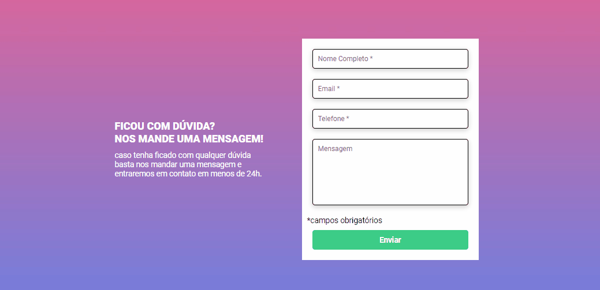
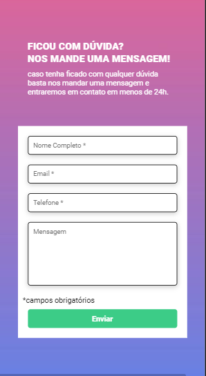

# Quest - Desafio proposto pelo Dev Quest.
## Ilustração animada - Formulario

 

## Ilustração Mobile

 

## Desafios

 Desafio proposto pelo Dev em dobro . Objetivo do projeto era criar um formulario simples , onde no JS ao clicar no botão selecionado do formulario
  se estivesse tudo preenchido ficaria verde(Preenchido) e vermelho (Nao preenchido).

## Dificuldades

 tive um pouco de dificuldade com a criação do js, mas consegui desenvolver mesmo demorando um pouco pois estava me equivocando no contexto do codigo,
 porem no final consegui fazer tudo como foi pedido.

## Aprendizado

  Entendende a importancia de analisar e pensar no projeto e na criação do codigo e aprendi como 
deixar o codigo refatorado e limpo para entender.

## Construção do projeto

<ul>
<li>HTML5</li>
<li>CSS3</li>
<li>JAVASCRIPT</li>
</ul>

### Feito por Lucas lôbo
